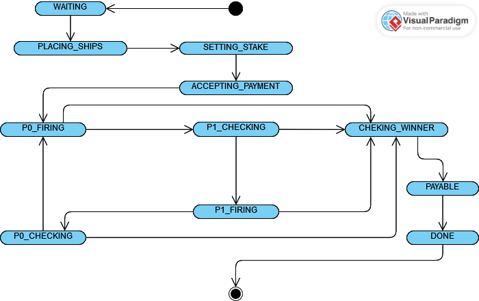

# Design Doc P2PBC “Battleships”

## Premise

The aim of this project is the development of a distributed application which implements a version of the classic game "Battleships”.
This project is comprised of 3 elements.
1. The Contract code to be deployed on the Ethereum blockchain
2. A web3 application which makes use of that contract
3. A design doc (this file) for both contract and application.

### Game design decisions

Games will be played on an 8x8 board with 20 ship tiles. These ships have no specific shape and can be placed anywhere on the board, but all 20 of them must be placed.
Any 8x8 board with 20 ship tiles and 44 water tiles is considered valid. The amount of ships and water tiles can be tweaked in the contract before compiling and deploying it, and it would be trivial to implement it in such a way that each host could declare their own parameters, but it was not deemed necessary for the scope of this demo.
The host player, the one who started the new game, always goes first.
The first player to hit all of their opponent’s ship tiles and subsequently prove the validity of their own board is declared the winner. If a player fails to prove their board was valid their opponent can accuse them of foul.
To prevent AFK players from locking down funds a process has been implemented through which users can accuse the opponent of committing a "foul". Users can only start this process while they are not in control of the state of the game, and their opponent can only clear this accusation by advancing the game into the next legal state. If the accusation has not been cleared after 5 (configurable at deployment time) blocks have been mined the contract's state is advanced to the very end, setting the accuser as winner and allowing them to retrieve any deposited funds, provided they did not cheat.

## Implementation Choices

The contract code was written in Solidity and it was deployed to a local Ganache test network using the Truffle suite.
The use of the Truffle development suite was suggested during lab classes. 
The contract code was tested during development with unit tests written in javascript with Truffle's integrated testing framework Chai.
The web3 app consists of a single html page and a corresponding javascript frontend application built with web3js, bootstrap, jQuery, and truffle-contracts. 

### State Machine

The Contract has 3 main phases composed of a certain number of sub-phases each. Roughly, we can divide the state of the contract in terms of the state of an individual game within the contract.
Each ‘game’ goes through:
1. Instantiation: 
    
    This phase begins when the game is first created by a user and ends when both users send in their board.
    
2. Game phase: 

    This phase is comprised of 4 sub-phases which model the turns of the two players, in a cycle. These phases are, in order: 
    1. Player 1’s firing round, during which player 1 can declare a spot on their opponent's board to fire on.
    2. Player 2's answer round, when player 2 is required to propose proof of whether a boat was hit or not.
    
3. Payment phase: In this phase the winner's board is validated and they are paid out. The game is then deleted from storage.

The above phases are implemented through 11+1 states present in the contract as an Enum. 

1. States 0 through 3: WAITING, PLACING_SHIPS, SETTING_STAKE, ACCEPTING_PAYMENT

2. States 4 through 7: P0_FIRING, P1_CHECKING, P1_FIRING, P0_CHECKING

3. States 8 through 10: CHECKING_WINNER, PAYABLE, DONE

A special state, "NONE" of numerical value 12, is only returned when queueing an id of a game which does not exist, either because the id in question hasn't been reached yet or because the game has ended and has been deleted.

Below, a picture of movement through states.

### Data Structures

#### Implementation of the user-side game board

The board must be publicly auditable, but only provable by the author. For this purpose we choose, as suggested, a Merkle tree. The root of the tree will be stored in the contract, and proof will be submitted each time by the author.
Given that the board is a SIZE_SIDE by SIZE_SIDE square of 0s (water) and 1s (ship), simply encoding this parameter into the leaf node of a Merkle tree would allow any third party to test each square for 1 or 0 and view anyone’s board.
Let's think of a different implementation.
Rather than encoding every single square of the the grid into our trie, we simply encode the 20 values where our ships are placed. This assigns a value from 0 to 63 to each square on the board, taking the bottom left as origin square, incrementing by one for each square on the right and by eight for each square up.
This creates  tries which can't be guessed at random and do not require additional sources of randomness.

### Contract

### Web-App
