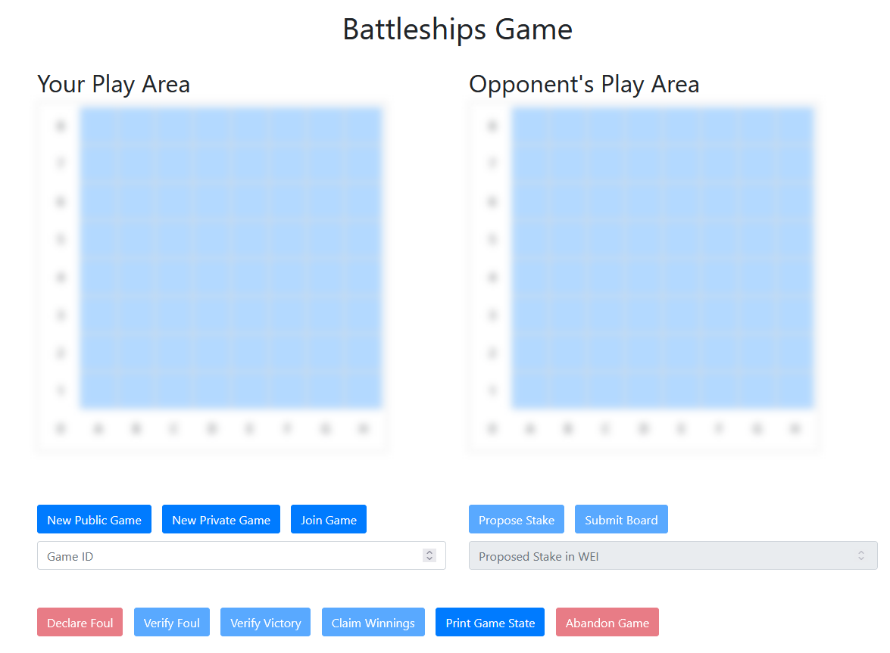
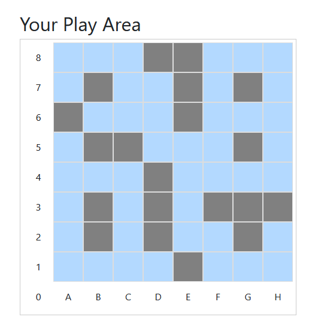
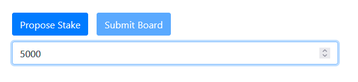
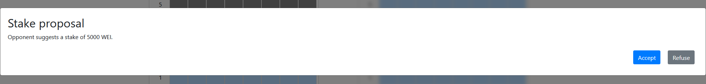
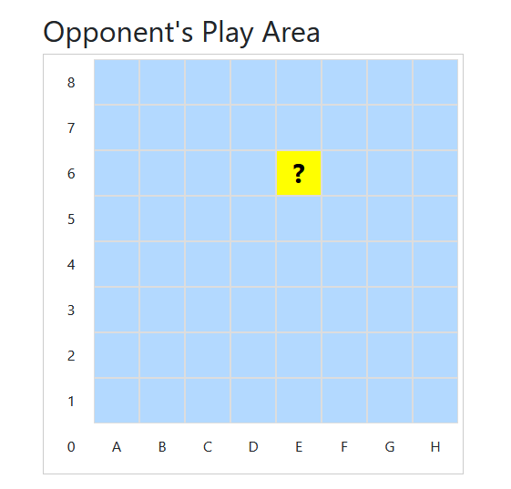
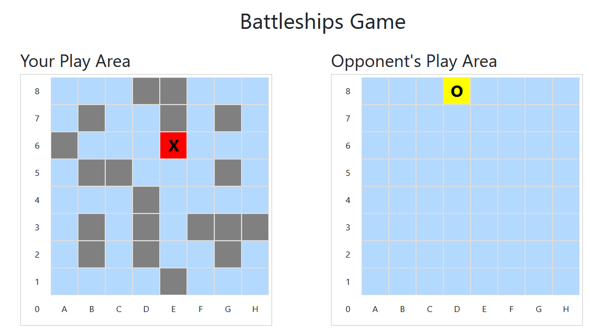
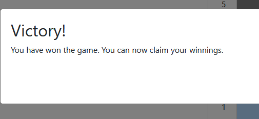
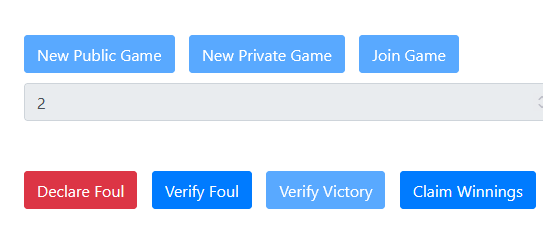

# Design Doc P2PBC “Battleships”

#### Table of Contents
1. [Premise](#premise)
    1. [Game design decisions](#game-design-decisions)
2. [Installation](#installation)
    1. [Requirements](#requirements)
    2. [Installation](#installation-1)
3. [Implementation](#implementation)
    1. [State Machine](#state-machine)
    2. [Data Structures](#data-structures)
        1. [Implementation of game list](#implementation-of-game-list)
        2. [Implementation of the Game struct](#implementation-of-the-game-struct)
        3. [Implementation of the Player struct](#implementation-of-the-player-struct)
        4. [Implementation of the Game Board](#implementation-of-the-game-board)
        5. [Implementation of the user-side game board](#implementation-of-the-user-side-game-board)
    3. [Contract](#contract)
        1. [Foul Mechanism](#foul-mechanism)
        2. [Merkle.sol](#merklesol)
    4. [Web-App](#web-app)
        1. [App Namespace](#app-namespace)
        2. [UI design](#ui-design)
        3. [Computing the Merkle Tree](#computing-the-merkle-tree)
        4. [Listening for Events](#listening-for-events)
        5. [Calling the contract](#calling-the-contract)
4. [Tests](#tests) 
5. [Gas Cost Analysis](#gas-cost-analysis)

## Premise

The aim of this project is the development of a distributed application which implements a version of the classic game "Battleships”.
This project is comprised of 3 elements.
1. The Contract code to be deployed on the Ethereum blockchain
2. A web3 application which makes use of that contract
3. A design doc (this file) for both contract and application.

### Game design decisions

Games will be played on an 8x8 board with 20 ship tiles. These ships have no specific shape and can be placed anywhere on the board, but all 20 of them must be placed.
Any 8x8 board with 20 ship tiles and 44 water tiles is considered valid. The amount of ships and water tiles can be tweaked in the contract before compiling and deploying it, and it would be trivial to implement it in such a way that each host could declare their own parameters, but it was not deemed necessary for the scope of this demo.
The host player, the one who started the new game, always goes first.
The first player to hit all of their opponent’s ship tiles and subsequently prove the validity of their own board is declared the winner. If a player fails to prove their board was valid their opponent can accuse them of foul.
To prevent AFK players from locking down funds a process has been implemented through which users can accuse the opponent of committing a "foul". Users can only start this process while they are not in control of the state of the game, and their opponent can only clear this accusation by advancing the game into the next legal state. If the accusation has not been cleared after 5 (configurable at deployment time) blocks have been mined the contract's state is advanced to the very end, setting the accuser as winner and allowing them to retrieve any deposited funds, provided they did not cheat.

## Installation

### Requirements

This project requires Nodejs, npm, Ganache, and Truffle to be installed on the host machine.
Run `npm install` to install all dependencies.

### Running the project

1. Start Ganache, create a chain and add the project to it by linking the truffle-config file in the project root.
    
    If your Ganache network is not running on `http://localhost:7545` you will need to change the network address in the truffle-config file.

2. Run `truffle compile` followed by `truffle migrate` to compile and deploy the contract to the local Ganache network

3. Run `npm run dev` to start the web3 app

4. Disable lite-server's synchronization functions at `http://localhost:3001/` by selecting the `Sync Options` menu from the left side of the page and clicking on `Disable all`. You might want to keep CodeSync enabled in case you want to edit the code and see the changes reflected in the browser.

5. Open `http://localhost:3000/` in your browser of choice. The app should be running.
    
    In case you want to run two instances of the application and connect separate Metamask accounts to them I would suggest using firefox and creating a new profile for each instance. Another option would be using different browsers.

## Implementation

The contract code was written in Solidity and it was deployed to a local Ganache test network using the Truffle suite.
The use of the Truffle development suite was suggested during lab classes. 
The contract code was tested during development with unit tests written in javascript with Truffle's integrated testing framework Chai.
The web3 app consists of a single html page and a corresponding javascript frontend application built with web3js, bootstrap, jQuery, and truffle-contracts. 

### State Machine

The Contract has 3 main phases composed of a certain number of sub-phases each. Roughly, we can divide the state of the contract in terms of the state of an individual game within the contract.
Each ‘game’ goes through:
1. Instantiation: 
    
    This phase begins when the game is first created by a user and ends when both users send in their board.
    
2. Game phase: 

    This phase is comprised of 4 sub-phases which model the turns of the two players, in a cycle. These phases are, in order: 
    1. Player 1’s firing round, during which player 1 can declare a spot on their opponent's board to fire on.
    2. Player 2's answer round, when player 2 is required to propose proof of whether a boat was hit or not.
    
3. Payment phase: In this phase the winner's board is validated and they are paid out. The game is then deleted from storage.

The above phases are implemented through 11+1 states present in the contract as an Enum. 

1. States 0 through 3: WAITING, PLACING_SHIPS, SETTING_STAKE, ACCEPTING_PAYMENT

2. States 4 through 7: P0_FIRING, P1_CHECKING, P1_FIRING, P0_CHECKING

3. States 8 through 10: CHECKING_WINNER, PAYABLE, DONE

A special state, "NONE" of numerical value 12, is only returned when queueing an id of a game which does not exist, either because the id in question hasn't been reached yet or because the game has ended and has been deleted.

Below, a picture of movement through states.

### Data Structures

The issues we need to solve with our data structures are as follows

1. How do we store the games for retrieval?

2. What describes a game?

3. What describes a player?

4. What describes a game board?

##### Implementation of game list

For issue #1 we decided to store games in a mapping of uint256 to struct. This allows for up to 2256 different games to be played on this contract without any need for complex queues of open and busy games which would require a high gas cost when creating or joining a game. We can be reasonably certain that nobody will be able to play 1.15792089237320006134268624010 × 1029 games on our contract before the heat death of the universe, and so this implementation is sufficient.

#### Implementation of the Game struct

Issue #2 concerns the elements required to actually play a game. We identify these as follows:

1. bool validity: used to determine whether this game actually exists or not when retrieving it from the mapping.
2. bool canPay: self-describing.
3. size 2 array of Player structs
4. uint decidedStake: the amount of WEI each player has agreed to stake on this game. This means the game's payout is DOUBLE this value.
5. uint blockNumber: used to store the block number during which a Foul is declared.
6. address accuser: stores the address of the player who has declared a Foul. This is zero if no foul is currently active.
7. bool privateGame: not included in the requirements list. If this value is true the game will not be a valid target for joining at random, and will only be joinable via its unique ID.
8. address winner: the candidate winner for this contract. This address can call the payment method only if canPay is also set to true.

#### Implementation of the Player struct

The key elements needed for to identify a player within a game have been selected as follows:

1. bool validity: as for Game, we need this.
2. bool hasPaidStake: self-describing.
3. address playerAddress: self-describing.
4. uint proposedStake: used in the stake agreement process. During stake agreement each player can propose different stake values. The contract will emit an event informing the chain of what that value is. A stake will be agreed upon once both players have proposed the same stake. At that point the contract will emit an event informing the chain the game can accept stake payments.
5. bytes32 boardTreeRoot: the root of the Merkle tree describing this player's game board. This is used to test the validity of proofs and shots sent to the contract.
6. Board shots_board: this player's view of their opponent's board. 

#### Implementation of the game Board

As mentioned above, this is the current player's view of their opponent's battlefield.

This element is used to keep track of where the player has fired upon, the total number of shots they fired, and the total number of opponent ships they hit. It is one of our anti-cheating methods, as it keeps track of how many board tiles exist in total and triggers a win when they have all been fired upon, preventing a dishonest player from submitting an empty board and forcing their opponent into an infinite game.
The presence of an array of booleans allows us to prevent a player from firing on the same spot twice, but we have decided to not implement this measure because if a player wants to lose on purpose that's their decision to make.

#### Implementation of the user-side game board

The board must be publicly auditable, but only provable by the author. For this purpose we choose, as suggested, a Merkle tree. The root of the tree will be stored in the contract, and proof will be submitted each time by the author.
Given that the board is a SIZE_SIDE by SIZE_SIDE square of 0s (water) and 1s (ship), simply encoding this parameter into the leaf node of a Merkle tree would allow any third party to test each square for 1 or 0 and view anyone’s board.
Let's think of a different implementation.
Rather than encoding every single square of the the grid into our trie, we simply encode the 20 values where our ships are placed. This assigns a value from 0 to 63 to each square on the board, taking the bottom left as origin square, incrementing by one for each square on the right and by eight for each square up.
We now evaluate the safety of this Merkle tree.
We are generating a random permutation of 20 elements (ships) in a set of 64 elements (board tiles). This means there are roughly 3.535218 × 1018 combinations available, computed by the classic formula $$\[ C(n, k) = \frac{n!}{k! \cdot (n - k)!} \]$$

Computing and storing that many combinations with today's hardware is not feasible, thus we don't need to worry about users pre-computing every possible board. 
If this had been a concern simply adding an additional source of randomness when hashing the node client-side would solve the issue. We would then have needed to supply this random value to the contract during both shot verification and board verification phases.

### Contract

The contract implements a total of 13 public or external functions, plus one final public debug function which can only be called by the contract's owner, and should be removed for final deplyment in a real environment.

All contract functions execute a long list of checks on the sender, gameID, game State and any other relevant values, making sure an illegal move can never be performed.

Listing them all would be superfluous. Let's instead discuss the general flow of a game.

1. User creates a new game, the ShareID event is emitted with their address and the ID the contract has assigned to that game in the arguments.
2. Other users can join open games, either at random (the first open game available) or directly, by ID. Once a game has been joined by a second player its state moves on and an event is emitted.
3. Users submit their boards. The server emits an event when they receive it, and another event when they have received both. Players can use this event to know they are now free to submit stake proposals.
4. The players agree on a stake as described before under "Implementation of the Player struct" and relative events are emitted. Once the stake has been agreed on players can pay the contract. At this point the contract moves into play phase.
5. Players alternate between the functions 'FireTorpedo' and 'ConfirmShot'. Calling 'FireTorpedo' will signal to the opponent of the caller that they have been fired upon via a ShotsFired event. The fired upon player can now call the ConfirmShot event, where they supply the hash of the target node and the truth value of that shot. The contract will verify that truth value and only advance the state of the game if it could confirm the player's claim. In either case the contract will emit an event related to the ConfirmShot function, where it either confirms or denies the caller's claim.
To make sure the caller's claim relates to the node they submitted the contract will compute the node once again and verify that it matches the supplied node and proof both.
6. This goes on until a player loses all ships. As mentioned before a contingency is in place in case one of the two players has supplied a fully empty board, where the game will end no matter what after all tiles have been fired upon.
7. The winner is asked to supply their board. For this they will need to supply:
    1. Full list of tile number, completely useless but small in size and not harmful. It could be interesting for future changes to the contract allowing for weird board shapes.
    2. Full list of ship positions encoded as a boolean array with one element per tile. If a ship is present the value is true, false otherwise.
    3. Full list of hashes of the tiles, which make up the nodes of our Merkle tree. These have to be supplied in incremental order starting from tile zero.
    4. Full list of proofs for each tile. This is a 2d array and has to follow the same order as before.
    5. Root of the merkle tree. Superfluous but not harmful.
8. If the winner's board passes the above check, the game is set to payable. Now the winner can call the WithdrawWinnings function and enjoy the payout.

#### Foul Mechanism

In all this we should mention the Foul mechanism.
As required, to prevent AFK players from stalling a game indefinitely, a Foul mechanism is in place.
The Foul mechanism can only be triggered by a player who is not responsible for advancing the state of the contract, and it can only be triggered after funds have been deposited. It would be pointless to stall before any money has been put on the table.
The Foul mechanism works by writing the caller's address in the 'accuser' field of the Game struct for the current game, and updating the 'blockNumber' field to the current block number.
The accused opponent has 5 blocks of time to advance the state of the contract into a position where the accuser has control. This will trigger the 'ClearFoul' method within the contract and zero the 'accuser' address. 
If the foul is not cleared within the alloted number of blocks then, when the accuser calls the 'CheckFoulTimer' function, the game will enter the CHECKING_WINNER stage, with the accuser as potential winner. 
The accuser will still be required to submit a valid board. Failure to do so will make the game unpayable, and will lock the stake funds with the contract. There is also no mechanism to delete a game in this state.
It is important to note that the accused player CANNOT clear a foul after the allotted number of blocks has passed, but an accuser can verify a foul at any time.

#### Merkle.sol

To keep size of the compiled artifact down and avoid hitting the Spurious-Dragons limit functions which do not require access to the state of a running game were moved into a separate contract.
In practice, this meant that all functions used to on the Merkle tree could be moved into their own contract, which was declared as a library and linked to the main Battleships.sol contract in the migration file.

To prevent inlining of Merkle.sol we turned on the compiler's optimization options.

### Web-App

The web dApp serving as user interface for our contract was developed using truffle-contract 4.0 and web3js 1.7.0, which crucially were NOT the suggested libraries we have seen during the laboratory classes.
The suggested libraries were severely outdated and presented both critical bugs (serializing 2d arrays was impossible in the provided version of web3js) and lacked basic features such as abi encoding of parameters.
Trying to work around these issues created significant delays. The major issue came from the fact that the contract had been tested with the latest version of web3js as installed via NPM, but there are many breaking changes between that version and the supplied one, and this did not become apparent until fairly later on in development.
On top of that finding a working mix of truffle-contract and web3js versions was non-trivial and required both multiple tries, and rewriting core functions of the dApp.

#### App Namespaces

The app presents 3 large namespaces

1. stateControlFunctions: Contains functions aimed at resetting the state of the page to zero.
2. MerkleHelperFunctions: Contains the functions needed to compute a Merkle tree from our board, as well as storing the various elements of our computed tree.
3. UIcontrolFunctions: Contains a long list of functions aimed at changing the appearence of the page as the game progresses, enabling and disabling components as needed. This is purely for the user's benefit as the contract will never accept an illegal input.

A fourth, overarching Namespace is of course App itself. Within App we have enclosed the whole code.

#### UI design

The web application was designed for ease of use.
On the left we can see the user's board, currently disabled, while on the right we can see the opponent's board, that too disabled.

When an user presses the new game function and completes the associated transaction, the ID of their new game will be displayed in the input field below, which will of course be locked down.

If a user clicks the join button with no input they will be placed in the first open game, and will be notified of that game's ID in the same way as described above. The game ID field can be used to select a specific game to join.

Once a game acquires two players the user's board for both of them will unlock, allowing them to place 'ships' by clicking on tiles. Clicking again will remove the ship.
Once 20 tiles have been placed the user can submit their board to the game.

After a board has been submitted through the relative button it becomes possible to propose a stake. Once a player proposes a stake their opponent will see receive a popup alerting them of that.

Clicking accept will invoke the proposeStake method of the contract with the displayed value. It is also possible to click cancel and counter-propose, or even propose the same stake, in which case the contract will see this as reaching an agreement and will move on to asking both parties to pay.
The GamePayable event will create a popup asking to pay. Refusal to do so will end the game and refund the opponent their stake, if that had already been paid. 
After both stakes have been paid the game moves on to the battle stage.

Clicking on a tile on the opponent's board (an action only possible when it is our turn) will generate a yellow tile with a question mark, which will remain such until our opponent has answered. After a few rounds of back and forth, the board will begin to look something like this.

The game proceeds until one of the two players either wins, or forfeits the game via the big red 'Abandon Game' button. The remaining player will be asked for their board and, if it validates, they will see a Victory notification.

At this point the "claim winning" button will become enabled. Completing that transaction will delete the contract and put clear the state of our web app.

As mentioned in the contract's section of this document, declaring a foul is an action which becomes available only after we have paid our stake. While we don't bother disabling and enabling the button each time the state of the game moves from player to opponent, the contract will still check whether or not we are in a legal state to declare a Foul.

#### Computing the Merkle Tree

In the MerkleHelperFunctions namespace we find two functions, one for generating the Merkle tree root, leaves and proofs from the player's board, and one for encoding a single tile of the board into a node, and computing the hash of that node.
The term 'node' indicates in this case the pair tile number concatenated with the tile's value, which is then hashed to produce the node's hash. Using the web3.eth.abi.encodeParameters function we can encode the inputs in a way which we are sure will mirror the encoding on the Contract's side.
The trio of Tree root, leaves and Tree from which we then compute the proof for a node on-demand are stored in this namespace, and used when verifying a shot or submitting a board for validation.

#### Listening for Events

The web app listens for events emitted by the contract, and updates the UI accordingly and game state accordingly. This is the preferred method to update the state, as updating after executing an action on the frontend side of things might lead to inconsistencies between the chain and the state represented in the frontend.
Rather than using the .wait function on the various events, we had to use the .on function, as the new version of truffle-contract does not support the former.

#### Calling the Contract

Calling the contract is a rather painless procedure after the initial setup. We simply make sure to fetch the current user account of Metamask, then make sure the contract is deployed and finally call the contract's methods with the appropriate parameters.
For functions which are supposed to update the UI we place that update as a .then clause of the contract call, as not to mess up the state of the frontend in case the user refuses the transaction.

## Tests

Extensive unit tests have been written for the contract, and can be found in the test folder. 
Each test is supposed to test a different logic partition of the contract and tests both the positive and negative outcomes of each function as expected of a unit test.
Sadly, code coverage for truffle suite doesn't seem to be available, at least not anymore, as the only tool which seemingly provided this functionality has deprecated support for Truffle.

## Gas Cost Analysis

Thanks to our extensive unit testing we can instantly compute the gas cost of a match played on our contract. Using the match_simulation.js test we run a normal match, and in it we extrapolate the average cost of gas for a single fire-reply turn. Multiplying that by 64, the maximum number of possible turns, we have a fairly solid approximation of the gas cost of a match.
Adding to that the cost to start a game and claim your winnings afterwards we come to a total of around 7.6M gas, which as of today, june 2023, would run us just shy of $280 on ETH mainnet.

| Phase           | Gas           | Cost  |
| --------------- |:-------------:| -----:|
| Initialization  | 650325        | $23.5 |
| Core game loop  | 6327680       |  $229 |
| Coda and payout | 710471        | $25.7 |

Let's break down the cost of the game itself function by function.

| Function        | Gas           | Cost  |
| --------------- |:-------------:| -----:|
| newGame         | 245751        | $10.3 |
| joinGame        | 110753        |  $4.6 |
| PlaceShips      | 235301        |  $9.8 |
| proposeStake    | 128911        |  $5.3 |
| payStake        | 40350         |  $1.6 |
| FireTorpedo     | 42369         |  $1.7 |
| CheckShot       | 79184         |  $3.3 |
| VerifyWinner    | 602056        | $25.2 |
| WithdrawWinnings| 108115        |  $4.5 |
| FoulAccusation  | 78201         |  $3.2 |
| CheckFoulTimer  | 50000         |    $2 |
| AbandonGame     | 57724         |  $2.4 |
| DeclineStake    | 102176        |  $4.2 |

Gas cost is subject to slight variations depending on the state of the contract, as some functions will cost more or less depending on the amount of data they have to process, but the above table should give a good idea of the cost of each function.